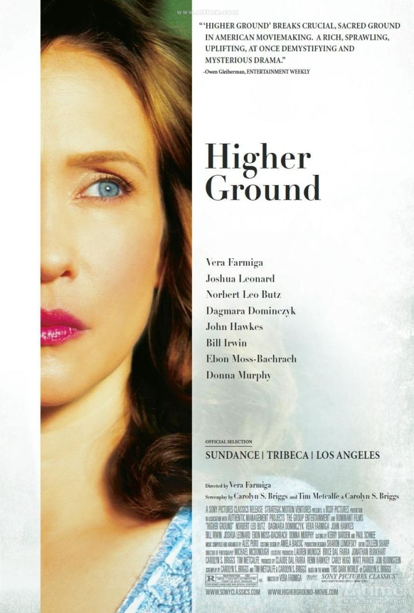

# 为什么一生信奉神却还是在床上痛苦的死去？

基督徒会说，没有上帝，不信仰永生，就会更痛苦，更难受，balabala.

但是他们忽略了，人很大的一个痛苦来源于失望。

基督徒信得越深，越相信上帝是客观的，上帝的拯救是及时的、现世的。

> 我虽然行过死荫的幽谷，也不怕遭害，因为你与我同在；你的杖，你的竿，都安慰我。[诗23:4]

即便他如此坚信，现世的病魔不会退却分毫，切身的痛苦不会减少半分，身体状况不会比临床的病友多一点好转。

这时他就会失望，一面痛恨上帝虚伪的爱，一面为自己的信心薄弱而懊悔，陷入尴尬两难的境地。

- 病人病好了，基督徒感谢赞美上帝的治愈。
- 病人去世了，基督徒感谢赞美上帝带信徒重回天家。
- 最讽刺的是，病人成为植物人了，基督徒终于找不到合适的理由赞美上帝。

每次聚会时，面对曾经基督徒扭曲的手指和面庞，他们无法赞美上帝。看到曾经的基督徒眼神无光、唾液下垂，他们无法赞美上帝。上帝为什么要让她成为无意识的植物人，她就算犯罪受责罚现在也没有机会悔改，她不能听讲道，不能读圣经，甚至不能控制自己的身体。上帝这样的安排有什么意义？这纯粹是对病人的折磨，也是对她的家人和周围信徒的煎熬。

这样的上帝不是仁爱的上帝、不是理智的上帝，而是变态的上帝、享受别人痛苦的上帝、乐于对人性和人的尊严进行戏弄和嘲讽的上帝。

电影《Higher ground》就讲述了这样一个故事，导演有自己的信仰经历，她通过细腻的观察，深刻的笔锋，展现了一个真实的信仰追寻，她希望上帝存在，希望与上帝建立关系，然而当她定晴去看时，却发现什么也找不到。

宗教信仰就是你可以闭着眼祷告，却不能睁着眼看。
