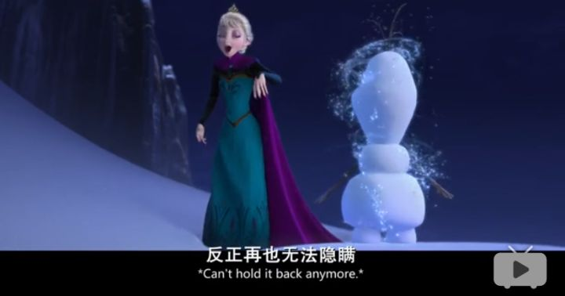
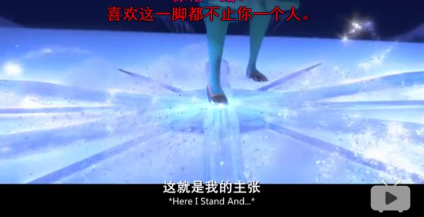

# 离教的感受

离教的感受完全可以用一首歌表达，这首歌是《Let it go》。

## 一

内心的风暴正在孕育，再怎样也压抑不住。

比谁都更希望上帝真实的存在，然而我内心的声音说，God is an illusion。

## 二

藏住自己的动摇，抑制内心的声音

尽可能做一个优秀的基督徒，一个团结上进的弟兄。

## 三

鼓足勇气，离开教会。

随他们评头论足，怕什么上帝责罚。

放马过来。

## 四

冲破一切的心理枷锁，是时候面对真正之我。

## 五

感受令人陶醉的自由，令人振奋的倔强。

上帝不能令我下跪，地狱也不能使我屈服。

I am the master of my fate,

I am the captain of my soul.

视频地址：[冰雪奇缘 Let It Go](https://www.bilibili.com/video/av2342876/)
