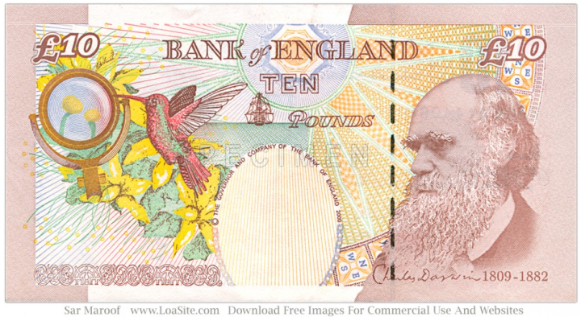

# 进化论可信吗？

> 事实证明进化论一直是，而且将继续是现代科学的奠基石。
>
> Evolutionary biology has been and continues to be a cornerstone of modern science.
>
> ——《科学、进化与神创论》（美国科学院、美国医学科学院 著）
>
> ——《Science, Evolution, and Creationism》

《科学、进化及神创论》是美国科学院1984年首次颁布的出版物的第三版。

美国科学院是一个独立的科学家团体，其成员由科学家自己根据其在科学领域的杰出贡献遴选出来。美国科学院自1863年起受国会委任，为联邦政府就科学技术方面的问题提出咨询。鉴于进化论对生物学、物理学、医学和改善卫生保健等日益增加的重要性，新的版本由美国科学院和美国医学科学院共同主持。

美国医学科学院作为美国科学院的附属机构创立于1970年，它提出有关生物医学、医学和卫生保健方面的科学建议。）

达尔文是位伟人，进化论是最伟大的科学发现之一。

10英镑是2000年11月7日发行的。10英镑背面人像是赫赫有名的达尔文。查尔斯.达尔文（Charles Darwin），是英国生物学家，博物学家，进化论的奠基人。1859年出版《物种起源》这一划时代的著作，创立了生物进化论学说，从而摧毁了各种唯心的神造论和物种不变论，奠定了现代生物学的基石。

这一钱币竟然能在以基督教为国教的英国得以发行，实在得益于英国无神论者、科学家、教育家、BBC等 忠义之士的不懈努力。

