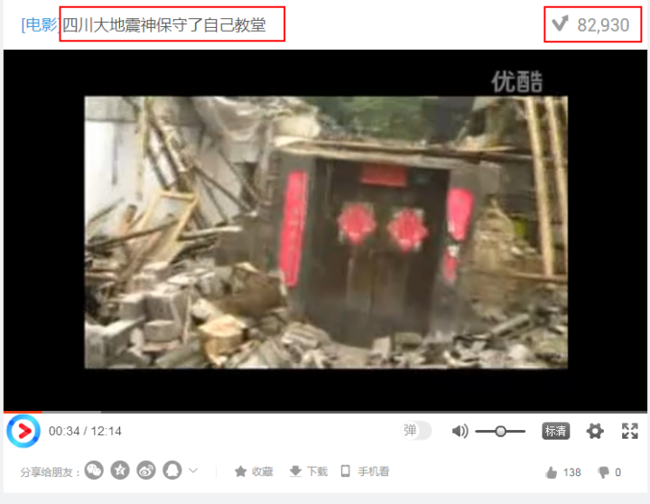
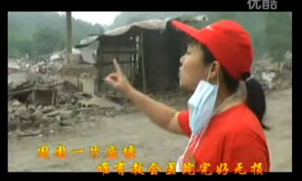

# 如何看待基督徒借四川地震传教？

每当大灾难来临，基督徒的心情都是复杂而诡异的。

为什么呢？

一方面，出于人类的共性，基督徒们也会向灾民表示默哀，向上帝祈祷 同胞安康。

另一方面，在他们的心灵深处，在悲恸之余，会产生一种诡异的窃喜。

他们会赞叹 耶和华是又真又活的上帝，《圣经》说得一点儿也不错，传福音的好机会又来了。

比如这次，九寨沟地震之后，基督教教圈里又传播起这样的见证：

以下为视频摘录：

“神迹！神迹！感谢上帝，赞美上帝，神赐真平安。”

“教会的房子几乎完好无损。”

“来聚会的人都得到平安了，没来聚会的人，可能因为买菜被砸死了。”

“这么简陋的房子，（没有倒塌），完成是神迹嘛。”

“阿门，阿门，阿门，阿门……………………”

“主啊，我感谢你在这个灾难中，你使中国人的心警醒。”

“主啊，这岂不是你的荣耀吗？”

“主啊，孩子这样不配的祷告，奉我主耶稣基督得胜的名。”

“在这个房子的中心有一座十字架。”

“丝毫没有震裂一点儿，见证神的大能。”

*（这个见证是08年汶川地震之后所拍，近期再次传播起来。）*

基督徒善长利用灾难传教，每次中国人经历什么苦难，他们就跳出来说，灾难都是不信上帝害的，还不赶紧信上帝。如果继续硬着颈项，上帝的愤怒会更大。

受害者尸骨未寒，家属们的泪眼将干未干，他们就迫不及待地指着别人的灵堂说，这就是不信上帝的下场。“感谢赞美上帝，你是又真又活的神。你的子女都蒙你的保守，平平安安。”

老子只想送 这样的上帝和这样的信徒 一句四川方言，mmp。

与基督徒接触久的人会发现，基督徒特别不喜欢看宣扬（中国）社会正能量的新闻，只喜欢盯着（中国）社会的负面新闻看。

每当看到社会变好，他们就会感觉，人怎么可以不靠上帝，过得越来越好呢。无神论者怎么可能有深沉的道德。一定有问题，妈的，一定是党媒的假新闻。

每当看到社会变坏，他们又要窃喜了，《圣经》说得过然没错，人不靠上帝就是不行。我信上帝信得太对了，这他妈的才是社会的真相，感谢上帝让我看清真相。

为了应验《圣经》的论断，他们乐于看到（中国）社会越来越差。

对于这类 心灵扭曲、精神猥琐的基督徒（广泛存在于现实和网络中的），老子再送你们一句，mmp。