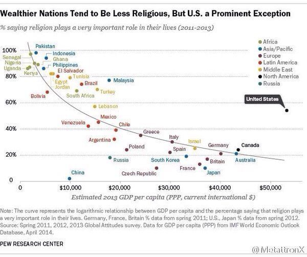

# 驳《值得无神论者深深思考的 10 个问题》

《值得无神论者深深思考的 10 个问题》是基督徒创作的，通过科学和理性传教的典型文章。

原文如下：

---
1. 越是有规律的，越有可能是被造出来的。 筷子是人类使用的最简单的工具之一。我们日常使用的筷子是哪来的?当然是人类制造的。为什么?因为有规律。如果我拿出两根树枝，哪来的?从外面捡回来的，因为没有规律。是否可以得出结论，越是有规律的越有可能是被造出来的。 而航天飞机，是人类制造的最复杂的工具之一了。没人会相信，一架航天飞机，会是经过漫长的地质年代，大自然碰巧形成的。 那么比航天飞机更复杂的是什么? 没错，那就是生命! 哪怕是最简单的单细胞生物，如草履虫，科学家都发现，其细胞核内部的结构之精巧，都令我们叹为观止。到现在为止，我们都造不出一个哪怕是最简单的单细胞生物。 因此，无神论无法回答的一个问题就是，具备如此精妙绝伦的结构的单细胞生物，既然不是人造的，是哪来的? 如果是大自然界碰巧形成的，那么为啥大自然不能碰巧形成比单细胞简单得多的航天飞机，手机，电脑，甚至一双筷子呢?也许有人说，有生命的是进化来的，无生命的不能。那好，请问，按照进化论，草履虫也是由无生命的复杂有机体进化来的吧?这个“马上”就能进化成生命的复杂有机体，和航天飞机，哪一个更复杂呢?如此复杂的有机体，你认为是进化来的，可是简单的筷子，却是被制造的?

2. 人类是被造出来的，从逻辑和技术的角度，都站得住脚。 人类从发现DNA结构，到复制多莉绵羊，仅仅用了几十年的时间。我们可以想像，再过50年，500年，人类的基因技术会发展到什么程度呢?人类科学家带着那时候的基因技术，到一个星球上，制造出适应那个星球气候和地质条件的各种植物、动物，再制造一种相对高等的智能生命来管理这些动物、植物。那么人类对这些生物而言，是什么? 所以说，不承认宇宙中有神，其实就是认为，人就是宇宙中的神! 浩瀚的宇宙中，存在比人类早亿年以上的高级的生命形式，在远古时代来到地球，利用他掌握的技术，造了人类等这些生命。那么，这个高级的生命形式，对于我们而言，是不是神呢?

3. 还有哪些国家是无神论?为什么?你又为什么相信无神论? 中国，越南，朝鲜，古巴……因为，唯物主义，是这些国家意识形态的基础。仅此而已! 不必为自己的无神论而骄傲，因为那并不是你独立思考的结果，而是你从小就被动接受唯物主义无神论教育的结果。无神论和科学精神，没有半毛钱关系。 不要以为我信神，就是被谁洗脑了。作为无神论者被洗脑的时候，是从无知的幼年就开始了。而我变成有神论的时候，已经是不惑之年。是我看了大量的资料(包括严谨的实验报告)之后才改变的。

4. “上帝”造人，听起来像神话，真的是没有科学依据的神话么? 我们现在的手机无线视频通讯技术，如果被古代人描述，并流传到现在，那么就是千里眼和顺风耳的神话。 现在无法实现神话，不等于永远都无法实现。

5. 人类感知不到的，就一定不存在么? 人类的感知能力非常有限，我们听不见超声波，狗可以。我们分辨不出来的味道，猪可以。我们有什么理由如此自负地相信自己的感官呢?我们看不到的，很有可能存在!

6. 我们有可能，只是鱼缸里的鱼。 今天早上，我照例去喂金鱼的时候，突然听见了金鱼之间的对话!这段对话让我思考许久。也许，思考这个世界的真相，比在猫眼上追求什么民主更有意义…… 小鱼：这个世界真的很奇妙啊，每当我们饿的时候，食物就从天而降了。每当水质变差的时候，水就自动变成了清水…… 大鱼：你认为这是奇妙的自然规律么?其实所有的规律背后，都有一个操纵的力量。这，来自神。 小鱼：你说的神在哪里?我怎么没见过。我游遍了鱼缸的每一个角落。 大鱼：他不在鱼缸里。甚至不在水里。你看不见不等于别的鱼看不见。 小鱼：他不在水里，怎么呼吸呢? 大鱼：他呼吸不用水，可以直接呼吸空气。 小鱼：可是他为什么要白白给我们食物呢?我听老鱼说，食物匮乏的时候，我们为了获得食物，甚至要付出生命的代价。可是你说的这个神却白白给我们宝贵的食物。这怎么可能? 大鱼：神是万能的，所以，神供给我们食物，很容易。 小鱼：如果神真的存在，那么神是哪来的? 大鱼：不能因为我们无法理解神是哪来的，就否认神的存在。甚至有一种可能，那就是，神都未必知道自己是哪来的。况且我们是鱼，我们的智商无法理解神的状态，即使告诉我们，我们也听不懂。 小鱼认为，神应该和自己一样，在水里用腮呼吸，否则就不可信。 我们认为，神应该和我们一样是有形的，否则就不可信。 其实，只要我们用我们的眼光去理解神，就会陷入困惑。

7. 生活中的巧合真的是巧合么? 我的一位朋友，因突发冠心病于某时离世。大家一定认为更多是偶然的。可是如果我告诉大家，这位朋友在另外一个城市的孪生兄弟，也几乎同时因为冠心病离世，你还认为这是偶然的么?我们仅仅知道很多疾病的背后有基因的规律在起作用。可是谁又知道，基因的背后是什么在起作用?生活中很多莫名的巧合，或者缘分，真的仅仅是偶然的么?难道冥冥中就没有一个定数? 如果这个世界，真的是一个虚拟的程序，那么，一切的偶然，岂不是都是被程序控制?

8. 这个世界是虚拟的，从技术和逻辑的角度，都没有任何问题。 人类发明计算机仅仅几十年，就创造出了虚拟技术。我们戴上特殊的传感器，接受特定的信号，就可以凭空“摸”各种面料。再过50年，500年，人类的计算机技术会发展到什么程度呢?我们完全可以虚拟出一个真实的城市。这个空间是如此的真实，以至于你分不清楚哪个是真实的世界，哪个是虚拟的世界。这时候，你会不会想，既然虚拟的世界都如此的真实，那么，我们所在的所谓真实的世界，就一定是真实的么? 柏拉图曾经说，如果我们永远背对山洞的洞口面壁而坐，洞口有火堆在燃烧，火堆和我们中间，有人在跳舞。于是我们真切地看到洞壁上跳舞的人影。谁说那些人影不是真切的呢?可是如果我们不回头看背后跳舞的人，我们永远不知道，什么才是真实，什么才是虚幻! 圣经中说，虚空的虚空。佛经说，色(一切物质)即是空。这是巧合?还是神在点拨人类，这个世界是虚空的?

9. 有神论(包括特异功能，气功，易经)违背自然规律么? 飞机刚被莱特兄弟发明的时候，很多科学家认为这是违背自然规律的，所以，根本不相信。 其实，飞机能飞，并没有违背自然规律，只是违背了当时人类掌握的自然规律。当时的人们不知道，除了浮力定律之外，还有另外一个领域的科学，那就是流体力学。

10. 猴子能在自然状态下，进化成人么? 进化论在科学上依据是基因突变。靠自然的基因突变，猴子能进化成人么? 我们知道，基因就是遗传的程序。而一段有效的计算机程序，如果某个指令代码顺序错了甚至缺失，会有什么后果呢?一定是程序错乱，而不会是程序优化。遗传程序也是一样的，基因突变带来的只能是畸形!

---

笔者回答

此文很多篇幅是在提问题，作者问完了也没有给出思考结果。对于这样没有结论的论述我们很难反驳。
一方面通过不置可否让对手难以捉住实体进行反驳，另一方面通过胡乱关联，牵强附会地传递了有神论更合理的信息。这招很狡黠，很奏效。

反驳的主要方法是，“请问你的结论是什么？” 等他的思绪落地，结论坐实后，我们就可有的放失，各个击破。

【1、越是有规律的，越有可能是被造出来的。】

作者举筷子，航天飞机的例子证明越有规律的，越有可能是被造的。进而推导出生命这种复杂的存在是上帝创造的。

驳斥：3个骰子掷出3个6的概率是1/216；我掷216次骰子出现一次3个6的概率就是很大的。当我掷出3个6时，基督徒告诉我因为3个6是很有规律的存在，因此我很可能作弊了。这不是搞笑吗？

近现代不到1千年的时间，人类就发明的汽车、电脑、手机、人工心脏、体外受精……地球在才长达46亿年的时间里可能演化出来的东西是任何人都无法想象的。

【2、人类是被造出来的，从逻辑和技术的角度，都站得住脚。】

这条不需要驳斥，因为基督徒是搬起石头砸自己的脚。因为按他的逻辑，人不是上帝神秘的创造，更没有所谓上帝所赐的神秘的灵魂。人不过是技术的产物，当人创人出现时，人就是人的上帝。

【3、还有哪些国家是无神论？为什么？你又为什么相信无神论？】

这条也不需要驳斥，我看不出这三句话之间有任何联系。基督徒在这条下附赘的解释也没有逻辑。

等基督徒想清楚了，我再来驳斥吧。

作者想暗示无神论国家都是贫穷国家，然而最新研究显示国家财富与宗教信仰程度负相关。

人均GDP越低的国家之中，越多国民认为宗教是其生命中的至关重要之事。

【4、“上帝”造人，听起来像神话，真的是没有科学依据的神话么？】

不知所云。

【5、人类感知不到的，就一定不存在么？】

作者想表达，上帝感知不到，但上帝是可能存在的。

驳斥：当然有这个可能。然后呢，当这个可能被证实之前，这就是一个可能而已，应该被搁置呀。你把“可能”当“确定”一样坚信就不对了呀。

【6、生活中的巧合真的是巧合么？】

全篇在问问题，等作者想清楚结论了，我来驳斥。

【7、这个世界是虚拟的，从技术和逻辑的角度，都没有任何问题。】

然后呢？

【8、有神论（包括特异功能，气功，易经）违背自然规律么？】

有部分违背，有部分不违背。然后呢？

【9、猴子能在自然状态下，进化成人么？】

作者说“基因突变带来的只能是畸形！”

你凭什么说“只能”？你应该说“有可能”

【10、进化，不可能跨越物种】

作者没有解释，就这么一句话。

我也不懂作者何以下此断言。

要么混淆“可能”与“事实”、“猜想”与“结论”，要么胡乱关联、穿凿附会，基督徒的护教理论不过尔尔。

