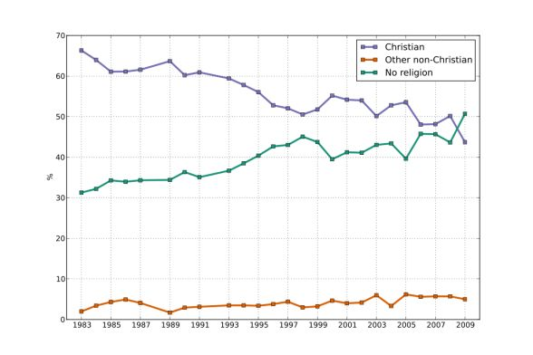

# 驳传教宣传单Ⅰ

传教宣传单原文如下：
----------
亲爱的朋友：您好!

人往高处走，水往低处流，这是人之常情。今天我们要免费送给你一个关系到您切身利益的礼物，那就是神的儿子耶稣基督在十字架上做成的恩典。只要您愿意抱着公正的态度接受，就必立即得到今生与将来的好处。请不要因为误会偏见而拒绝此时此刻已经来到您身边的福份。

请您仔细想一想以下几个问题：

1. 有些人认为基督教是迷信、是神话，为什么全世界绝大多数杰出的科学家却都接受呢?据联合国统计，近三个世纪300位杰出的科学家中只有20位不信，38位无法调查，而明确信神的竞有242位(其中有大家熟悉的近代最伟大科学家牛顿、发明大王爱迪生、发现X光的伦琴，以及伏特、安培、欧姆、居里夫人、爱因斯坦等等，他们的头脑总不致于比我们笨吧)。
　　　　
2. 如果《圣经》是骗人的虚构故事，为什么反对的人一直找不出一个漏洞呢?圣经在2700年前说大地是圆球形并悬在虚空之中。在公元前6世纪，古希腊数学家毕达哥拉斯最早提出“地球是圆球形”。1522年，麦哲伦历经三年环球航行，证实地球是圆球形的。4000年前的“挪亚方舟与洪水”事件，过去一直被人们认为是神话传说，经过1986年4月1 2日《人民日报》的报导证实，才知确有其事，而圣经中预言的准确应验更令历史学家们佩服得五体投地。比如2100年前预言的以色列的亡国与将来的重新复国就是无可推诿的例证之一(查考历史，公元70年以色列被罗马帝国灭亡，百姓照着圣经预言四散到世界各国中，在长达将近1900年的漂流生活中，非但没有被异族同化，反而照着《圣经》的预言于1948年5月14日在巴勒斯坦地区重新成立以色列国)。
3. 如果有人告诉您，您家的房子不是设计建造的，而是在一次偶然的爆炸中产生的，您一定会认为他不是开玩笑就是在愚弄您。您可要知道，这个宇宙的结构远比您家的房子复杂与精密，而且运行极其准确，如地球带着月亮以每秒30公里的速度绕太阳旋转，每转一圈是365天5小时48分46秒，分秒不差，数不清的星球都在自己的轨道上丝毫不乱地运行(你知道十字路口若没有交通警察管理将何等的混乱)。所以今天我们也告诉您，这个伟大奇妙而又有规律秩序的宇宙，不是爆炸碰撞变成的，而是全能的神所创造并管理的。
4. 进化论认为人是从猿猴进化而来的，但经过科学分析：第一、人与猿猴有根本不能跨越的分别：①人的血液是铁质，猿是铜质；②人有12对肋骨，猿只有10对；③人有声带，能表达各种语言词汇，猿没有声带，只能发出单调的嘶嘶叫声。第二、化石证明进化论的错误。1984年，中国科学家侯先光及中国科学院南京地质古生物研究所，在云南省昆明市附近的澄江县帽天山，发现了澄江化石生物群，进一步证实在寒武纪(距今约6亿年前)大量的动物门类同时突然出现，展示了地球上生命形式的爆炸性突变，无任何进化痕迹可寻。1995年7月19日，《人民日报》(海外版)发表了一篇署名为丁邦杰的评论文章：《向进化论挑战的澄江化石》。文章说：“19世纪达尔文发表《物种起源》，其中一个核心论点便是：生物体是逐渐变异的。但是，经科学家长期研究发现，距今5．3亿年的寒武纪早期，地球的生命存在形式，突然出现了单样性到多样性的飞跃。”获中科院特级奖的陈均远教授等也证实：当时有一个“动物大爆炸”的现象。有兴趣的读者还可以参考《人民日报》海外版1999年11月5日头版新闻。
5. 有些人认为：人死如灯灭，一了百了，根本没有灵魂。美国心脏科权威罗林斯教授(Maurice Rawlings)的著作《死是怎么回事》(Beyond Death’s Door)里面记载他亲耳听到病人的自述。说明肉体的死亡是另一种生命形式的开始。有一件趣事值得一提：一次他抢救一位七十三岁的老人，经历了六次反复死亡。罗林斯不得不要求别的医生来帮忙，并说：“再试一次，如果这次休克仍无法控制，我们只好放弃!”作者用十分感叹的笔触写道：多么盼望我当时没有说这句话！因即使他当时不醒人事，却居然完全听得一清二楚!”后来他对我说：“你怎么说‘我们放弃’这句话，当时被抢救的人可是我啊!”朋友，如果人无灵魂，请问这经历六次反复死亡的老人怎么会听见医生这句话呢？关于死后有灵魂的报道，读者如果有兴趣可参考天津出版社出版的《死亡是怎么一回事》北京出版社出版的《死亡的回忆》；陕西敦煌出版社出版的《打开生死之门》。
6. 如果神的存在值得怀疑，为什么当人向神祷告后，他的难处就得到解决昵?现举一例：孙中山先生1896年在伦敦被清政府绑架，关押期间，自知必死无疑，孙中山先生靠着所信的耶稣恳切祷告，获救后他给友人写道：弟被诱擒于伦敦，十有余日...自知必死，弟此时惟有痛心忏悔，恳切祷告，一连六七日，自第七日，心中突然得安慰，自知此祷得答应…当天神感动每日送饭监视他的英国童子。原先他把孙中山的密信交给清大使，这天他却把密信转交给孙中山的英国老师，于是惊动了英国，满清使馆无奈，只得放人。亲爱的朋友，如果神不存在，孙中山如何向他祷告呢?神又如何能听孙中山的祷告呢?
7. 朋友，你知道公元的来历吗?公元拉丁文为Anno Domini，意即主的生年(缩写A.D)；公元前则为英文Before Christ．意即基督以前(缩写B.C)。世界文明未开发前，各国皆用自己的纪年法，如中国以皇帝纪年。随着文明程度的提高，没有统一纪交。公元533年始，渐在世界推行以神的儿子耶稣基督，即世界统一的纪年法。朋友，若耶稣在历史上并不存在，或只是常人，那么全世界二百多个国家会乐意接受吗?
8. 十字架是全世界救人的标志。医院、红十字会都以十字架为标记，这是什么原因昵?原来耶稣为了拯救全人类，担当我们的罪被钉死在十字架上，使十字架这本来是罗马帝国残酷的杀人刑具，却奇妙地变成救人的标记。
9. 为什么全世界在每周的第一天都休息一天呢?圣经说：“七日的第一日《即禮拜天，禮拜六是周末)”。耶稣从死里复活，因为祂是神的儿子，祂也不会被死拘禁，祂从死里复活，证明祂是神的儿子。所以为了纪念祂的复活，全世界的人都在这一天休息，向祂礼拜。
　　　　

亲爱的朋友，看了这么多的事实，请不要再等候犹豫。我们将以最大的心愿衷心奉劝您，切切不要错过这关系到您切身利益，却不需要您花任何代价，并且已经到您身边的福份。

---

笔者反驳：

造谣一张嘴，辟谣跑断腿。

此宣传单的内容杂无章，绝大多数没有给出信息来源，相当一部分无法考证。

疏理每一项都花费不少功夫，并且导致篇幅冗长。

为减轻读者的阅读压力，本文在分析论述时，不再转述原宣传单的内容。

文章包含二级目录，第一级对应宣传单的每一项，第二级是笔者的逐点分析。

## 基督教宣传单第一项

> “据联合国统计，近三个世纪300位杰出的科学家中只有20位不信，38位无法调查，而明确信神的竟有242位……”

这一论述起源于《名人的信仰》，沈荡生 编著，未知出版社于2005年出版。

书中原文是这样写的：

> 现代科学发展初期，英国社会的基督徒，约占总人口的20％，但在英国早期皇家学会中，基督徒的比例却高达90％！据统计，近三个世纪，最著名的300位科学家，除38位因无从考查是否信上帝而不予计算外，只有20位不信上帝。明确信上帝的有242位，占92.4％；据《诺贝尔奖奥秘》一书统计，美国获得诺贝尔奖的286位科学家中，有73%的人是基督徒，19%的人是犹太教徒，也就是说信有上帝的科学家占92%。

1. 英国社会的基督徒的比例一直很高，从来没有低至总人口的20%。

*Time series from the British Social Attitudes Survey showing the religion to which people consider themselves to belong*

由图可知，英国的基督徒比例在逐年下降，从65%降到了45%，但是没有低到过20%。

2. 原书作者说“据统计”，并未写根据什么机构统计。

基督教传播者也意识到这一说法毫无说服力，于是人为添上“据联合国统计”，以此进行二次传播。

联合国怎么会做这种统计呢？难道为了加深各国、各宗教的对立？

3. 并无《诺贝尔奖奥秘》这本书，只有《诺贝尔获奖奥秘》这本书，这本书出版于1987年，截止1987年，美国获诺奖的人数是184人（包括经济学奖，和平奖），并非沈荡生所谓的284人。

4. 牛顿是自然神论者。

知乎有一句名言，如果批评不自由，赞美没有意义。

同样，如果离教不自由，信教没有意义。

牛顿生活的年代（1643-1727）就是离教不自由的时代，也是英国的宗教逼迫最严重的时代。

1620年 清教徒不堪英国国教的逼迫，冒着葬身大海的风险，远走美国。

当时的《集会法》规定：不得在私人寓所和其他地方举行不符合国教教会规定的任何宗教仪式，违者将被囚禁或罚款。《五英里法》规定：不服从国教会的神职人员和教师不得进入一切城市或他以前所住的教区五英里之内的地区。

同属基督教的清教徒尚且被逼迫，牛顿敢表达自然神论的思想，已经冒天下之大不韪了。

5. 爱迪生并非基督徒

爱迪生是自然神论，他在1910年10月2号，接受纽约时报采访时，坦承自己的观点：

> Nature made us — nature did it all — not the gods of the religions. （自然创造了我们，完全是自然，而非任何上帝。）

1920年，爱迪生致力于发明通灵机，他希望与死去的母亲通话。

与死者通话是基督教的大忌。《圣经.旧约》记载，以色列君王扫罗与死去的亡灵撒母耳通话，上帝极其厌恶，让他死于敌人非利士人手中。

《圣经》反复强调：

> 无论男女，是交鬼的或行巫术的，总要治死他们，人必用石头把他们打死，罪要归到他们身上。 ——利未记20章27节

基督教认为与亡灵通话是不服从上帝的安排，企图掌控自己的命运，严重冒犯上帝的权柄，是上帝极端愤怒的罪行。

由此可见爱迪生不仅不是基督徒，而且能用实际行动挑战《圣经》的威吓。

6. 爱因斯坦不是基督徒

> 我无法想象一个会对自己的创造物加以赏罚的上帝，也无法想象它会有像在我们自己身上所体验到的那样一种意志。我不能也不愿去想象一个在肉体死亡以后还会继续活着；让那些脆弱的灵魂，由于恐惧或者由于可笑的唯我论，满足于觉察现存世界的神奇的结构，窥见它的一鳞半爪，并且以诚挚的努力去领悟在自然界中显示出来的那个理性的一部分，即使只是其极小的一部分，我也就心满意足了。 ——爱因斯坦《我的世界观》（此文最初发表在1930年出版的《论坛和世纪》（Forum and century）84卷，193-194页。当时用的标题是“我的信仰”（What I believe））

7. 居里夫人不是基督徒

> 于是我们决定结婚，婚礼于1895年7月中旬举行。我们决定采取最简单的结婚仪式，即不采取与宗教形式的仪式，因为皮埃尔不信仰任何宗教，我也没有学习过或信仰过宗教。 ——《居里夫人自传》

## 基督教宣传单第二项

1. “如果《圣经》是骗人的虚构故事，为什么反对的人一直找不出一个漏洞呢？”

如果《西游记》是虚构的故事，为什么反对人的找不出一个漏洞呢？

如果《山海经》是虚构的故事，为什么反对人的找不出一个漏洞呢？

因为他们在自己的体系下，是自洽的，是有最高的解释权的。

无论外人如何反驳，他们只需要说一句反对无效。

2. 《圣经》并没有肯定大地是圆形。

《圣经》经常提到“地极”，还说地球有根基、角石、柱子。

> 地的根基安置在何处？地的角石是谁安放的？ ——《约伯记》38章6节
>
> 地和其上的居民都消化了。我曾立了地的柱子。 ——《诗篇》75章3节
请问何来角石，何来地的柱子？ 这分明还是远古时代天圆地方的思想。

3. 《圣经》并没有预言以色列的复国

预言的核心是有没有预测时间范围，并且预言的结果要是可证伪的。

然而《圣经》的预言没有这两个条件，大多数没有时间限制，而且其预言的论述是模糊的，可以在无穷大的范围内解释。

比如，基督徒称《圣经》预言了弥赛亚（救主）的降临，耶稣就是弥赛亚。但是犹太人认为弥赛亚还没有降临。

为什么呢，因为所谓的预言是模糊的，可以有多重解释。

## 基督教宣传单第三项

宇宙的秩序并不能证明宇宙有创造者，因为归纳法是不能保证准确的。

如果上帝可以不依靠其他其他事物存在，为什么宇宙不可以呢？

如果宇宙太伟大的就需要上帝创造他，那比宇宙更伟大的上帝是谁创造的呢？

现在有一个简单的假设：世界本来就是这个样子。

基督教在这个假设之上，增加了三个：上帝存在，上帝使世界成为这个样子，上帝还在管理世界。

然而，基督教的假设不仅没有简化问题，反而把问题变得更加模糊、更加玄幻。

## 基督教宣传单第四项

寒武纪时期的“生命爆发”已经得到合理的解释，比神创论更符合科学。

在寒武纪前期生命主要是软骨的形式，留下的化石较少。在寒武纪时间进行产生了大量硬壳生物，其化石得以大量保存，造成生命爆发的现象。

《圣经.创世纪》记载，上帝先创造了海洋生物，然后飞鸟，最后陆生生物。

然而古生物学证实，生命出现的顺序并非如此，是先海洋生物，中间是陆生生物，最后产生的飞鸟。

因此，神创论只是一种原绐的想象，不能接受科学史实的检验。

## 基督教宣传单第五项

美国心脏科权威罗林斯教授(Maurice Rawlings)应该把他的数据，整理成视频、音频，给学术界研究。并且他应该把论文发到Science，柳叶刀 等科学期刊上。

如果他用科学而非臆想的方式证明了灵魂的存在，那么二个诺贝尔奖都不足以表彰他对科学、对人类的贡献。

## 基督教宣传单第六项

孙中山晚年不再信仰基督教

孙中山早年在基督教浸会学校学习，对基督教曾一度报有好感，并受洗加入基督教。

他晚年不再参加基督教活动，多次表达自己不信仰基督教。

> 列强除对中国实行政治和经济的侵略压迫外，“还有宗教的侵略。他们用政治力、经济力来耗夺中国人的物质还不算，又用宗教力来耗夺中国人的精神；一班神甫牧师依仗着他们的国力，包庇教民，干预讼词，欺压其教以外的人，无所不至，受其虐者饮心刺骨。这也是义和团发生的重要原因！ ——《国民党为“九七”国耻发表宣言》
>
>宗教的感觉，专是服从古人的经传。古人所说的话，不管他是对不对，总是服从，所以说是迷信。就宗教和科学比较起来，科学自然较优。 ——《孙中山全集》第8卷，第316页

宋庆龄在回忆孙中山的信仰时说：

> 我还要告诉你，有一个传布得颇广的谣传，说孙中山在弥留时要求把他葬在一处基督教公墓并由基督教会主持葬礼。这完全是假的。孔祥熙和孙科听了许多朋友的话，曾坚持要在协和医院小教堂举行一次基督教追思礼拜，借以证明孙中山不是一个布尔什维克。 孙中山明确地告诉我，他从来不信什么上帝，他也不相信传教士。 ——宋庆龄1966年4月13日写给爱泼斯坦的信

## 基督教宣传单第七项

公元的来历是为了纪念耶稣诞辰（4 BC），但这并不表示耶稣是神，只能说明他的影响力大。

你知道十二月份分别纪念的是谁吗？

一月，雅努斯，罗马守护神  
三月，玛尔斯，罗马战神  
五月，玛雅，罗马生命神  
六月，裘诺，罗马众神之王  
七月，朱里斯，罗马君王凯撒  
八月，奥古斯都，罗马君王屋大维 

如果名称被广泛使用就被认为是神，那六位罗马神（或君王）是不是也是真神？

## 基督教宣传单第八项

红十字的十字架与基督教没有直接关系。

1864年8月，来自12个国家的代表在日内瓦开会，制定了关于救护战地伤兵的《关于改善战地武装部队伤者病者境遇之日内瓦公约》。1956年在日内瓦召开的有各国政府代表参加的会议上，通过了修订的《日内瓦公约》。《公约》的第三十八条规定：“为对瑞士表示敬意，白底红十字旗样，系将其联邦国旗翻转而成”。这清楚地表明，红十字会的红十字标志与刑具和宗教的十字架无关，而是为了感谢瑞土人亨利·杜南和日内瓦公益会组织，模仿瑞士的国旗设计而成的。

*瑞士国旗*

基督徒认为红十字是为了纪念耶稣，那么是不是数学符号“+”也是为了纪念耶稣呢？

## 基督教宣传单第九项

星期天虽然称为礼拜天，也不表示我们要向他礼拜。

你知道星期天还有其他名字吗？太阳神日。

公元前7至6世纪，巴比伦人便有了星期制。他们把一个月分为4周，每周有7天，即一个星期。由日、月、火、水、木、金、土7个神，各掌管一天。

这一制度传到了希腊罗马，被君士坦丁固定下来。

一周七天的名称分别为：

星期天，Sunday（太阳神日）  
星期一，Monday（月亮神日）  
星期二，Tuesday（战神日）  
星期三，Wednesday（主神日）  
星期四，Thursday（雷神日）  
星期五，Friday（爱神日）  
星期六，Saturday（土神日） 

如果名字叫做礼拜天就要敬拜耶稣，那我们还应该敬拜下这七位神。

基督教是中国的合法宗教，信教是宪法赋予公民的信仰自由。

然而，宪法没有赋予信徒传播谣言的自由。

基督教的这张宣传单，不过千余字，每百字就有一个谣言。这些谣言打着科学的旗号，宣传的知识违背科学，使用的逻辑违背理性，危害匪浅。而且这些谣言经过精心的组织，毫无准备的学生群体很容易受蛊惑。

我国的法律明确规定，校园传教是违法行为。

> 非宗教团体、非宗教院校、非宗教活动场所、非指定的临时活动地点不得组织、举行宗教活动，不得接受宗教性的捐赠。 ——《 宗教事务条例 （新）》
>
> 第四十一条 非宗教团体、非宗教活动场所不得组织、举行宗教活动，不得接受宗教性的捐献。 ——《宗教事务条例 （现行）》第二十条

对比新旧条款可知，国家通过立法强调了：非宗教院校不允许组织、举行宗教活动。

因此，请基督徒们自尊自爱，依法信教。希望广大青年学子提高警惕，远离违法传教活动。