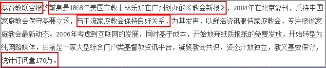
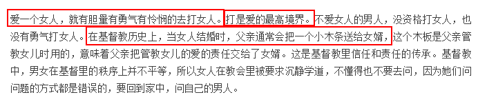
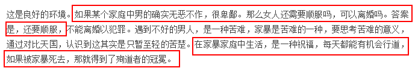
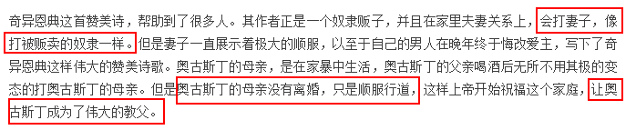
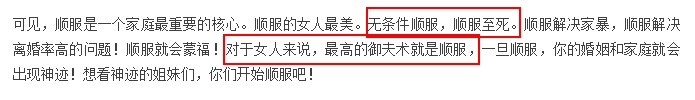
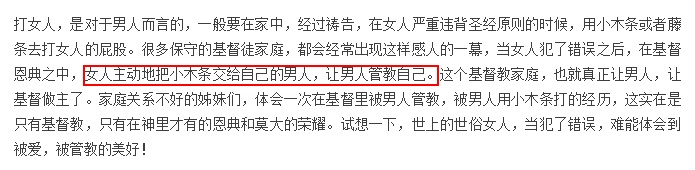
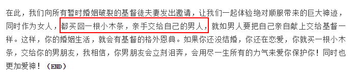

# 基督徒歧视女性吗？

基督徒当然不会承认这一点。

他们把这种特别的对待 当作 特别的关爱。

这篇文章可不是普普通通的平信徒的信道感悟，而是教牧多年的牧者，发布的《基督教联合报》的重要讲章。

这篇文章深刻地、彻底地表露了，基要派基督教对待女性的态度。

他说，

一、打是爱的最高境界

二、家暴至死也要顺服男人，不能反抗。

三、伟大的信徒都有过家暴被祝福的例子。

四、顺服至死

五、女人要主动领打

六、现在就开始

教会的信徒中女性最多（女牧师极少），大多数小姑娘们喜欢教会的唱诗、教会的建筑、教会的小资情调，认为教会内有自由和民主的空气，因而参加教会。

殊不知教会就是一超级女德培训班，中国封建时代的女德已经被打倒了，你们也知道批判。而同一时期产生的基督教的女德，你们觉得高级了，属灵了？

提到东方人的念佛、扶乩等宗教实践时，你们就视之为“老土”，称之为“迷信”；但提到西方人的祈祷，领圣体等宗教实践时，你们却视为“神圣”，视为“真理”？

哎。醒醒吧，何必自轻自贱。