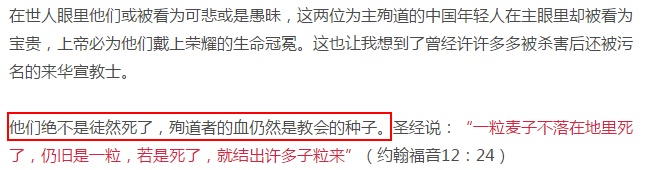
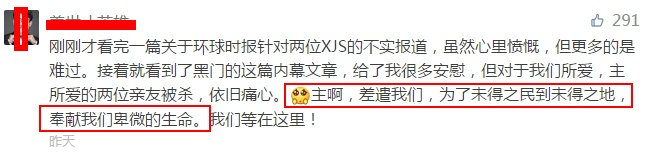
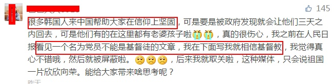
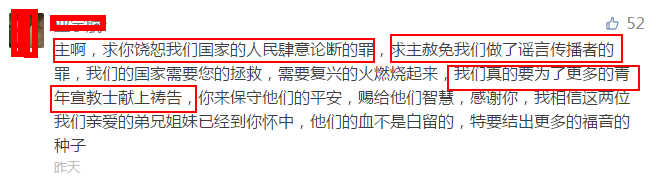

# 如何看待新闻《中国人被IS杀害:韩国人忽悠中国90后赴巴传教》？

新闻链接如下：[真相！韩国人带中国人赴巴传教，酿绑架惨剧](http://world.huanqiu.com/exclusive/2017-06/10812123.html)

两位同胞的血己使我感到悲哀，此后基督教对事件的报道更让我出离愤怒。

吃人不吐骨头，莫过于斯。

## 一

*（上为标题截图，文章在昨天已经100000+的阅读量）*

善良，是啊。

善人做善事，恶人做恶事，让善人做恶事，非宗教操刀不可。

针对大学生的教会，常常组织校园传教，讲道离不了 拯救灵魂的使命，为主传教的荣光。耳濡目染之下，涉世未生的年轻人，特别是善良的年轻人，很容易做出全职传教的选择。

前些天正是大学生毕业季，有一位基督教姊妹联系到我，交流信仰问题。

还没开始寒暄，我脑海里闪过的第一个念头就是，“同学，毕业后别全职服侍，先工作……”

果然，她给我的回复就是，已经准备全职服侍了。

最后，我努力说服她，她用心说服我，僵持不下，我被拉黑了。

可以预想，全中国的大学毕业生中，有多少已经被基督教捕获，成为传教死士。

同学们，如果大学里遇到校外传教士，请立即向保卫科举报。（如果是本校同学，可以提醒他（她）不要传了。）

也许善良的你想给他（她）一次机会，但他们绝不会给你善良的同学信教后抽身的机会。你的善举可能保护无数的同学。

二、

*（上为文章截图）*

两位风华正茂的、纯真善良的生命就此陨落，教会不去反思自己的思想是否极端，传教策略是否符合实际，风险有没有充分管控……

他们却说，一个信徒死了，还有千千万万个信徒跟上。

他们还想让更多的年轻基督徒前仆后继。

文章既然罗列了二人朋友【注：极可能是基督徒朋友】对二人的评价，为什么没有写父母对二人之死的评价？不是本未倒置吗？

二人的死，是两个家庭的亡。

若父母是信徒也罢，算有了心灵寄托。

但父母是非信徒呢？你们让四老如何度过余生？ 你们负责赡养吗？

天堂我不确定是否存在，我确定你们创造了地狱。

二个尚且不够，你们还要造更多。

三、

再看看文章的评论区，让我们深味下这非人间的悲哀。

