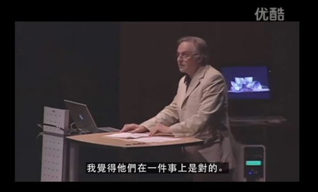
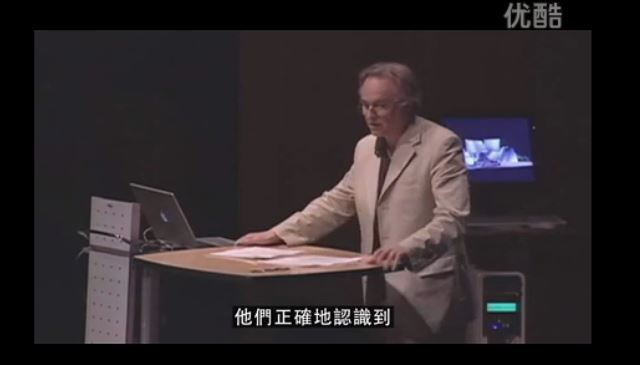
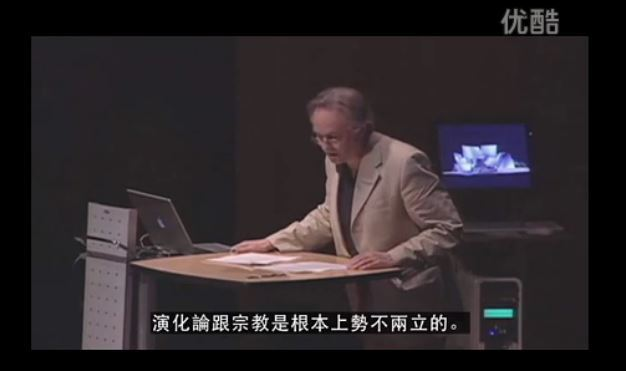

# 道金斯——“战斗的无神论者”

宗教与进化论和谐相处的唯一办法是——宗教不要把手伸到进化论的领域来，伸手必被捉。

即便教宗（及极少数开明信徒）承认进化论的正确性，进化论对宗教神秘的消解作用也不会因此停止，宗教迟早变成只剩宗教情操的人文价值观。

然而，更多的信徒选择负隅顽抗，对进化论极尽歪曲揶揄之能事，他们避实就虚，闲目塞听，妖言惑众，无神论因此而反击，故称“战斗的无神论者”。

又有些无神论者，且称为“温和的无神论者”，他们对“战斗的无神论者”颇有非议，认为自己不信神就好，不应该攻击宗教，要尊重宗教。

哈哈，Let them be, 爬得越高，才看到得越多。他们没有看到“无神论”之精髓，也没看到人类思想潮流的激变，他们想把你往下拉，实属正常。

“战斗的无神论者”是无神论的守望者（看守城池的人）和开拓者。