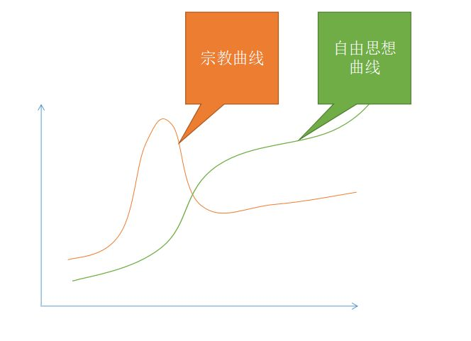

# 宗教是不能走的捷径

因为在很多情况下，局部最优解不是全局最优解。

当一个群体 处于动乱危机之中的 最简单的办法 就是 创造一个上帝（一段神话）来提升对挫折的忍耐能力、对敌人的作战能力。

换句话说，信仰上帝就像咳兴奋剂，信徒在危急情况下可以爆发超常的战斗力。

比如，《旧约》中记载的 摩西，约书亚，靠一神论的精神旗帜迅速清洗的迦南各部落。

两伊战争中，双方都以宗教思想武装民众，战争就极端残忍血腥。

宗教这种兴奋剂特别容易上瘾，极难戒除。

他们就形成了以宗教为基础的利益阶层，上至教皇，下至最底层信徒，全是利益群体中的一部分。

他们对一切威胁到系统的人或物都视为敌人、视为魔鬼。他们维护宗教，甚于维护父母和自身的性命。

于是他们越发封闭起来，为了防止被瓦解，不断地压迫不同思想（异端），也构建了神学体系，杜绝任何重大的动摇。

（《圣经》说上面的经文一笔一划都不能废去，《古兰经》说上帝的启示已经封印完成了。）

*宗教的发展状态*

宗教的发展状态就是这样↑↑↑，他们通过捷径进入一个局部的高峰，但是那个高峰也把他们困死在那里。当他想要从这个高峰跳到其他曲线，就必须忍受一个陡然下降的过程，时间一般还很漫长。

目前穆斯林世界的作法是死守这个高峰，只可惜就算他们把伊斯兰教义发挥到极致，也不会超过20世纪末的水平。

美英等国则是分兵作战，前卫的人已经抛弃了上帝，但还有相当大比例的人选择死守基督教价值观。这两种世界的巨大鸿沟（+被掩盖的种族矛盾、阶层矛盾）可能让他们分崩离析。

因此，不要轻易走捷径，眼前的最优解未必是全局最优解。